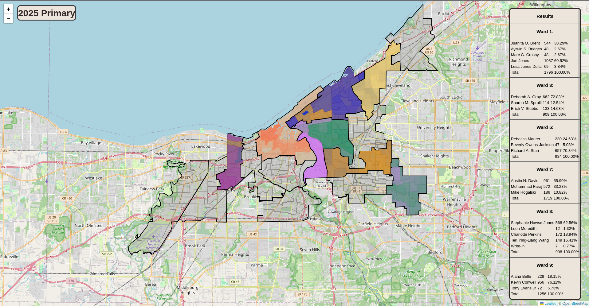

# cleveland.dev

This website contains election maps for the city of Cleveland, Ohio, along with other interesting pages using civic data.

## Usage

#### To run locally:
  1. Install [Crystal](https://crystal-lang.org/)
  2. Clone this repository
  3. Run the following commands:
```bash
  cd cleveland.dev/
  #note: in production, the below command is run with the --release compiler flag
  crystal run src/clevelandelectionmap.cr
```
  4. Navigate to http://0.0.0.0:8080 in the browser

#### Example:

<p align="center">
    
</p>

## Development

Todo:
  * Add 2025 general election
  * Gather old election data and precinct GeoJSON
  * Migrate the real time RTA tracker at [wheresrta](https://wheresrta.net) to a subdomain (requires rewrite, Github [here](https://github.com/rogueocelot/wheresrta))
